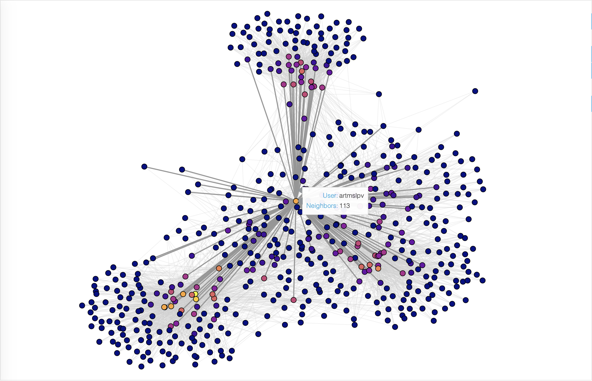

# instabot_data_analysis
A complementary data analysis project for my python Instagram bot

* WIP, but feel free to check it out!

## Built using:
* Bokeh – used for data visualisation
* NetworkX – used to create a graph from obtained list of followers

This project gave me an interesting insight on connections between my friends and their relationships with each other.

### Things noted:
* Friend group clustering which is clearly visible
* Famous figures and brands tend to locate in the central area connecting different groups of people

### Use cases:
* One could target a marketing campaign towards users who share similar interests(blogs, brands, etc.) and/or connected with each other.
